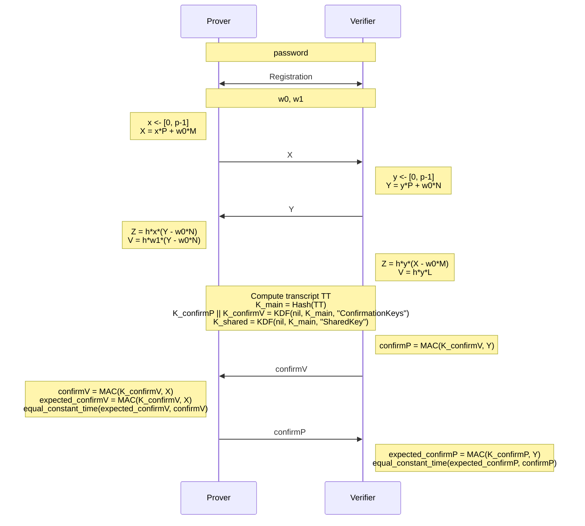

# SPAKE2+

[](https://github.com/jiep/spake2plus/actions/workflows/test.yml)
[](https://github.com/jiep/spake2plus/actions/workflows/lint.yml)
[](https://github.com/jiep/spake2plus/actions/workflows/wheel.yml)
[](https://github.com/jiep/spake2plus/actions/workflows/dependabot/dependabot-updates)

**SPAKE2+** is a Python 3 implementation of SPAKE2+ protocol, according to [RFC 9383
SPAKE2+, an Augmented Password-Authenticated Key Exchange (PAKE) Protocol](https://www.rfc-editor.org/rfc/rfc9383.html).

## What is SPAKE2+?

SPAKE2+ is a cryptographic protocol designed to establish a shared secret between two parties (Prover and Verifier) over an insecure channel. It is an augmentation of the SPAKE2 protocol, adding explicit identities to prevent key compromise impersonation (KCI) attacks. 

The protocol is efficient, secure, and suitable for password-based authenticated key exchange (PAKE). Unlike traditional methods that transmit hashed passwords or challenge-responses, SPAKE2+ ensures the shared secret is derived without exposing the password, even in the presence of eavesdroppers or active attackers.

### Key Features:
1. **Password-Based Authentication**: Ensures both parties authenticate using a shared password, protecting against unauthorized access.
2. **Implicit Mutual Authentication**: If the protocol succeeds, both parties confirm they share the same password.
3. **Resistance to KCI Attacks**: Explicit identities (`idProver` and `idVerifier`) are incorporated into the protocol to prevent impersonation by a compromised party.
4. **Elliptic Curve Cryptography (ECC)**: Leverages ECC for computational efficiency and security.
5. **No Password Exposure**: The password itself is never transmitted or derived directly during the protocol.

### How it Works:
1. **Registration Phase**: Both parties exchange public parameters to initialize the protocol securely.
2. **Password Derivation**: The shared password is processed with Argon2id, using explicit identities (`idProver` and `idVerifier`) and the hash function of the ciphersuite, to derive keying material.
2. **Key Exchange**: The Prover and Verifier compute and exchange values (`X`, `Y`) to establish a shared secret.
3. **Verification**: Both parties derive cryptographic secrets (`confirmP`, `confirmV`) to verify the integrity of the exchange and finalize authentication.

SPAKE2+ is commonly used in applications requiring secure password-based authentication without relying on a trusted third party. It is especially suitable for environments where both parties already share a secret (like a password) and need to establish a secure communication channel.


### Protocol overview



## Requirements

This package requires the following dependencies:

* `cryptography==43.0.3`
* `tinyec==0.4.0`

All dependencies are automatically installed when you install the package via `pip`.

## Installation

You can install this package locally using `pip`:

```bash
pip install -e .
```

## Usage

```bash 
usage: spake2plus [-h] {verifier,prover,registration} ...
```

### Offline registration

The `Prover` computes the values `w0` and `w1`, as well as the registration record `L`. `w0` and `w1` are derived by hashing the password with the identities of the two participants. `w0` and the record `L` are then shared with the `Verifier`. 

```bash
spake2plus registration --password 1234 --idProver alice --idVerifier bob
```

### Verifier

```bash
usage: spake2plus verifier [-h] --idProver IDPROVER --idVerifier IDVERIFIER --context CONTEXT --w0 W0 --L L
                           [--ciphersuite {P256-SHA256,P256-SHA512,P384-SHA256,P384-SHA512,P521-SHA512}]
```

### Prover

```bash
usage: spake2plus prover [-h] --idProver IDPROVER --idVerifier IDVERIFIER --context CONTEXT --w0 W0 --w1 W1
                         [--ciphersuite {P256-SHA256,P256-SHA512,P384-SHA256,P384-SHA512,P521-SHA512}]
```

### Example: Verifier

The `Verifier` acts as a server in the protocol. You can run it as follows:

```bash

spake2plus verifier  --idProver alice --idVerifier bob --context 1234 --password 1234 --salt 12341234
```

The `Prover` acts as a client in the protocol. You can run it as follows:

```bash
spake2plus prover --idProver alice --idVerifier bob --context 1234 --password 1234 --salt 12341234
```

> [!NOTE]  
> If not specified ciphersuite, `P256-SHA256` is used by default.
>
> Ciphersuites allowed: `P256-SHA256`, `P256-SHA512`, `P384-SHA256`, `P384-SHA512`, and `P521-SHA512`.

> [!WARNING]  
> `idProvider`, `idVerifier`, `context`  must be the identical for `Prover` and `Verifier`! 


## Contributing

Contributions are welcome! To contribute, follow these steps:

1. Fork the repository.
2. Create a new branch (`git checkout -b feature/new-feature`).
3. Make your changes and commit them (`git commit -m 'Add new feature'`).
4. Push to your branch (git push origin feature/new-feature).
5. Open a pull request.

## License

This project is licensed under the MIT License. See the [LICENSE](LICENSE) file for more details.

## Disclaimer

> [!CAUTION]
This code has not been audited or formally reviewed for security. Use it at your own risk and only for educational purposes or in non-critical environments.