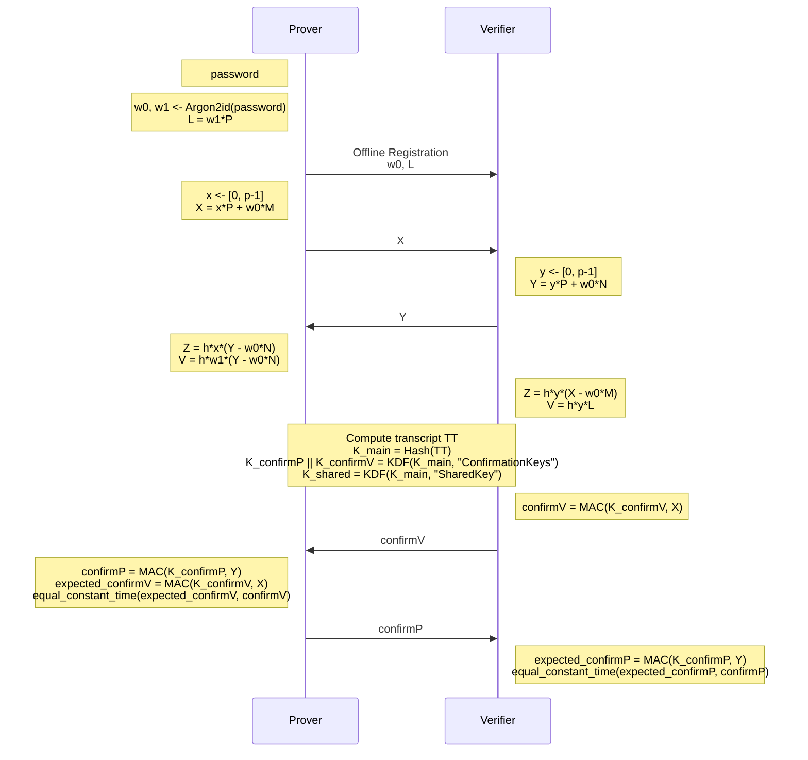

# SPAKE2+

[](https://github.com/jiep/spake2plus/actions/workflows/test.yml)
[](https://github.com/jiep/spake2plus/actions/workflows/lint.yml)
[](https://github.com/jiep/spake2plus/actions/workflows/wheel.yml)
[](https://github.com/jiep/spake2plus/actions/workflows/dependabot/dependabot-updates)

<p align="center">
  
</p>

**SPAKE2+** is a Python 3 implementation of SPAKE2+ protocol, according to [RFC 9383
SPAKE2+, an Augmented Password-Authenticated Key Exchange (PAKE) Protocol](https://www.rfc-editor.org/rfc/rfc9383.html).

> [!CAUTION]
This code has not been audited or formally reviewed for security. Use it at your own risk and only for educational purposes or in non-critical environments.

## What is SPAKE2+?

SPAKE2+ is a cryptographic protocol designed to establish a shared secret between two parties (Prover and Verifier) over an insecure channel. It is an augmentation of the SPAKE2 protocol, adding explicit identities to prevent key compromise impersonation (KCI) attacks. 

The protocol is efficient, secure, and suitable for password-based authenticated key exchange (PAKE). Unlike traditional methods that transmit hashed passwords or challenge-responses, SPAKE2+ ensures the shared secret is derived without exposing the password, even in the presence of eavesdroppers or active attackers.

### Key Features:
1. **Password-Based Authentication**: Ensures both parties authenticate using a shared password, protecting against unauthorized access.
2. **Implicit Mutual Authentication**: If the protocol succeeds, both parties confirm they share the same password.
3. **Resistance to KCI Attacks**: Explicit identities (`idProver` and `idVerifier`) are incorporated into the protocol to prevent impersonation by a compromised party.
4. **Elliptic Curve Cryptography (ECC)**: Leverages ECC for computational efficiency and security.
5. **No Password Exposure**: The password itself is never transmitted or derived directly during the protocol.

### How it Works:
1. **Registration Phase**: Both parties exchange public parameters to initialize the protocol securely.
2. **Password Derivation**: The shared password is processed with Argon2id, using explicit identities (`idProver` and `idVerifier`) and the hash function of the ciphersuite, to derive keying material.
2. **Key Exchange**: The Prover and Verifier compute and exchange values (`X`, `Y`) to establish a shared secret.
3. **Verification**: Both parties derive cryptographic secrets (`confirmP`, `confirmV`) to verify the integrity of the exchange and finalize authentication.

SPAKE2+ is commonly used in applications requiring secure password-based authentication without relying on a trusted third party. It is especially suitable for environments where both parties already share a secret (like a password) and need to establish a secure communication channel.


### Protocol overview



## Requirements

This package requires the following dependencies:

* [`cryptography`](https://pypi.org/project/cryptography/)
* [`tinyec`](https://pypi.org/project/tinyec/)

All dependencies are automatically installed when you install the package via `pip`.

## Installation

You can install this package locally using `pip`:

```bash
pip install -e .
```

## Usage

```bash 
usage: spake2plus [-h] [-v] [--host HOST] [--port PORT]
                  {verifier,prover,registration} ...

SPAKE2+ Protocol

positional arguments:
  {verifier,prover,registration}
    verifier            Run the verifier role in the
                        SPAKE2+ protocol
    prover              Run the prover role in the SPAKE2+
                        protocol
    registration        Perform registration for the Prover

options:
  -h, --help            show this help message and exit
  -v, --verbose         Increase output verbosity (e.g.,
                        -v, -vv, -vvv)
  --host HOST           Host to connect to (default:
                        localhost)
  --port PORT           Port to connect to (default: 12345)
```

### Offline registration

The `Prover` computes the values `w0` and `w1`, as well as the registration record `L`. `w0` and `w1` are derived by hashing the password with the identities of the two participants. `w0` and the record `L` are then shared with the `Verifier`. 

```bash
usage: spake2plus registration [-h] --password PASSWORD --idProver IDPROVER
                               --idVerifier IDVERIFIER
                               [--ciphersuite {P256-SHA256,P256-SHA512,P384-SHA256,P384-SHA512,P521-SHA512}]

options:
  -h, --help            show this help message and exit
  --password PASSWORD   Password for key generation
  --idProver IDPROVER   Prover's identity
  --idVerifier IDVERIFIER
                        Verifier's identity
  --ciphersuite {P256-SHA256,P256-SHA512,P384-SHA256,P384-SHA512,P521-SHA512}
                        Ciphersuite to use (default: P256-SHA256)
```

### Verifier

```bash
usage: spake2plus verifier [-h] --idProver IDPROVER --idVerifier IDVERIFIER
                           --context CONTEXT --w0 W0 --L L
                           [--ciphersuite {P256-SHA256,P256-SHA512,P384-SHA256,P384-SHA512,P521-SHA512}]

options:
  -h, --help            show this help message and exit
  --idProver IDPROVER   Prover's identity
  --idVerifier IDVERIFIER
                        Verifier's identity
  --context CONTEXT     Protocol context
  --w0 W0               Value for w0 as hexadecimal string
  --L L                 Value for L as hexadecimal string
  --ciphersuite {P256-SHA256,P256-SHA512,P384-SHA256,P384-SHA512,P521-SHA512}
                        Ciphersuite to use (default: P256-SHA256)
```

### Prover

```bash
usage: spake2plus prover [-h] --idProver IDPROVER --idVerifier IDVERIFIER --context
                         CONTEXT --w0 W0 --w1 W1
                         [--ciphersuite {P256-SHA256,P256-SHA512,P384-SHA256,P384-SHA512,P521-SHA512}]

options:
  -h, --help            show this help message and exit
  --idProver IDPROVER   Prover's identity
  --idVerifier IDVERIFIER
                        Verifier's identity
  --context CONTEXT     Protocol context
  --w0 W0               Value for w0 as hexadecimal string
  --w1 W1               Value for w1 as hexadecimal string
  --ciphersuite {P256-SHA256,P256-SHA512,P384-SHA256,P384-SHA512,P521-SHA512}
                        Ciphersuite to use (default: P256-SHA256)
```

## Examples

### Registration

```bash
spake2plus registration --password superImporT4antPassWord! --idProver alice --idVerifier bob --ciphersuite P256-SHA256
```

<details>

<summary>Show output</summary>

```bash
2024-12-01 14:06:51.789 [INFO] Ciphersuite: P256-SHA256
2024-12-01 14:06:52.048 [INFO] w0 = 3bccdf7f0940907dac69758d327eb9c40c5a7f95ee63a80e042e5473ce789e76
2024-12-01 14:06:52.048 [INFO] w1 = 59f7bce5c93c087e114d95b542f100124e1814be7f383c376a9a441045092a0b
2024-12-01 14:06:52.048 [INFO] L  = 04c9b019fbe6d4e727dfd9cd831f3c36a6fec8b05972bed62d3b0493c8cfc2163dc739cda27dcb7aa6726008f7312281d9ffe61edc178af1f26a96a1a6dc6cfbc4
```

</details>

### Verifier

The `Verifier` acts as a server in the protocol. You can run it as follows:

```bash
spake2plus verifier --idProver alice --idVerifier bob --context KeyExchange --w0 3bccdf7f0940907dac69758d327eb9c40c5a7f95ee63a80e042e5473ce789e76 --L 04c9b019fbe6d4e727dfd9cd831f3c36a6fec8b05972bed62d3b0493c8cfc2163dc739cda27dcb7aa6726008f7312281d9ffe61edc178af1f26a96a1a6dc6cfbc4 --ciphersuite P256-SHA256
```

<details>

<summary>Show output</summary>

```bash
2024-12-01 14:11:45.727 [INFO] Ciphersuite: P256-SHA256
2024-12-01 14:11:45.728 [INFO] Verifier is listening on localhost:12345...
2024-12-01 14:13:04.771 [INFO] P -> V [65]: X = 04dfc96734066fd75a4093d402f33945312f71637c8515524cd44736d0d762cd8a162a72d868fb5e155908f01af1319f69739f6591451ca9978b6bb64a4c4383a8
2024-12-01 14:13:04.886 [INFO] P <- V [65]: Y = 04835bd8437b2dd3bd920dcbb3aa81c72874e8bdb81aa76c3c2b99a7e9ca22ad397dd844c701eb77264d61f13926a5fc3730d100bb08e4935d770885392d29e1dd
2024-12-01 14:13:04.887 [INFO] V: Computing key schedule...
2024-12-01 14:13:04.888 [INFO] P <- V [32]: confirmV = ab44635917470ac4cf52130c881749151e544b8f4fcc987aad2e64afc5201665
2024-12-01 14:13:04.979 [INFO] P -> V [[32]]: confirmP = d97eba35ac718b69bc8549bb5d73646d42d68739cf392f4d346eab88a6e556a3
2024-12-01 14:13:04.979 [INFO] V: Protocol completed successfully.
```
</details>

### Prover

The `Prover` acts as a client in the protocol. You can run it as follows:

```bash
spake2plus prover --idProver alice --idVerifier bob --context KeyExchange --w0 3bccdf7f0940907dac69758d327eb9c40c5a7f95ee63a80e042e5473ce789e76 --w1 59f7bce5c93c087e114d95b542f100124e1814be7f383c376a9a441045092a0b --ciphersuite P256-SHA256
```

<details>

<summary>Show output</summary>

```bash
2024-12-01 14:13:04.724 [INFO] Ciphersuite: P256-SHA256
2024-12-01 14:13:04.725 [INFO] Connected to Verifier at localhost:12345
2024-12-01 14:13:04.771 [INFO] P -> V [65]: X = 04dfc96734066fd75a4093d402f33945312f71637c8515524cd44736d0d762cd8a162a72d868fb5e155908f01af1319f69739f6591451ca9978b6bb64a4c4383a8]
2024-12-01 14:13:04.886 [INFO] P <- V [65]: Y = 04835bd8437b2dd3bd920dcbb3aa81c72874e8bdb81aa76c3c2b99a7e9ca22ad397dd844c701eb77264d61f13926a5fc3730d100bb08e4935d770885392d29e1dd
2024-12-01 14:13:04.977 [INFO] P: Computing key schedule...
2024-12-01 14:13:04.979 [INFO] P <- V [32]: confirmV = ab44635917470ac4cf52130c881749151e544b8f4fcc987aad2e64afc5201665
2024-12-01 14:13:04.979 [INFO] P -> V [32]: confirmP = d97eba35ac718b69bc8549bb5d73646d42d68739cf392f4d346eab88a6e556a3
2024-12-01 14:13:04.979 [INFO] P: Protocol completed successfully.
```
</details>

> [!NOTE]  
> If not specified ciphersuite, `P256-SHA256` is used by default.
>
> Ciphersuites allowed: `P256-SHA256`, `P256-SHA512`, `P384-SHA256`, `P384-SHA512`, and `P521-SHA512`.

> [!WARNING]  
> `idProvider`, `idVerifier`, `context`  must be the identical for `Prover` and `Verifier`! 


## Ciphersuites

| Ciphersuite     | G            | Hash              | KDF                   | MAC                   | PBKDF              |
|-----------------|--------------|-------------------|-----------------------|-----------------------|--------------------|
| `P256-SHA256`   | P-256        | SHA256 [RFC6234]  | HKDF-SHA256 [RFC5869] | HMAC-SHA256 [RFC2104] | Argon2id [RFC9106] |
| `P256-SHA512`   | P-256        | SHA512 [RFC6234]  | HKDF-SHA512 [RFC5869] | HMAC-SHA512 [RFC2104] | Argon2id [RFC9106] |
| `P384-SHA256`   | P-384        | SHA256 [RFC6234]  | HKDF-SHA256 [RFC5869] | HMAC-SHA256 [RFC2104] | Argon2id [RFC9106] |
| `P384-SHA512`   | P-384        | SHA512 [RFC6234]  | HKDF-SHA512 [RFC5869] | HMAC-SHA512 [RFC2104] | Argon2id [RFC9106] |
| `P521-SHA512`   | P-521        | SHA512 [RFC6234]  | HKDF-SHA512 [RFC5869] | HMAC-SHA512 [RFC2104] | Argon2id [RFC9106] |

<details>

<summary>Show references</summary>

- [RFC6234] Eastlake 3rd, D. and T. Hansen, "US Secure Hash Algorithms
            (SHA and SHA-based HMAC and HKDF)", RFC 6234,
            DOI 10.17487/RFC6234, May 2011,
            https://www.rfc-editor.org/info/rfc6234

- [RFC5869] Krawczyk, H. and P. Eronen, "HMAC-based Extract-and-Expand
            Key Derivation Function (HKDF)", RFC 5869,
            DOI 10.17487/RFC5869, May 2010,
            https://www.rfc-editor.org/info/rfc5869

- [RFC2104] Krawczyk, H., Bellare, M., and R. Canetti, "HMAC: Keyed-
            Hashing for Message Authentication", RFC 2104,
            DOI 10.17487/RFC2104, February 1997,
            https://www.rfc-editor.org/info/rfc2104

- [RFC9106] Biryukov, A., Dinu, D., Khovratovich, D., and S.
            Josefsson, "Argon2 Memory-Hard Function for Password
            Hashing and Proof-of-Work Applications", RFC 9106,
            DOI 10.17487/RFC9106, September 2021,
            https://www.rfc-editor.org/info/rfc9106

</details>

<details>

<summary>Show values for N and M</summary>

- `P-256`

  ```
  M = 02886e2f97ace46e55ba9dd7242579f2993b64e16ef3dcab95afd497333d8fa12f

  seed: 1.2.840.10045.3.1.7 point generation seed (M)
  ```

  ```
  N = 03d8bbd6c639c62937b04d997f38c3770719c629d7014d49a24b4f98baa1292b49

  seed: 1.2.840.10045.3.1.7 point generation seed (N)
  ```

- `P-384`

  ```
  M = 030ff0895ae5ebf6187080a82d82b42e2765e3b2f8749c7e05eba366434b363d3dc36f15314739074d2eb8613fceec2853

  seed: 1.3.132.0.34 point generation seed (M)
  ```

  ```
  N = 02c72cf2e390853a1c1c4ad816a62fd15824f56078918f43f922ca21518f9c543bb252c5490214cf9aa3f0baab4b665c10

  seed: 1.3.132.0.34 point generation seed (N)
  ```

- `P-521`

  ```
  M =
  02003f06f38131b2ba2600791e82488e8d20ab889af753a41806c5db18d37d85608cfae06b82e4a72cd744c719193562a653ea1f119eef9356907edc9b56979962d7aa

  seed: 1.3.132.0.35 point generation seed (M)
  ```

  ```
  N = 0200c7924b9ec017f3094562894336a53c50167ba8c5963876880542bc669e494b2532d76c5b53dfb349fdf69154b9e0048c58a42e8ed04cef052a3bc349d95575cd25

  seed: 1.3.132.0.35 point generation seed (N)
  ```

</details>


## Contributing

Contributions are welcome! To contribute, follow these steps:

1. Fork the repository.
2. Create a new branch (`git checkout -b feature/new-feature`).
3. Make your changes and commit them (`git commit -m 'Add new feature'`).
4. Push to your branch (git push origin feature/new-feature).
5. Open a pull request.

## License

This project is licensed under the MIT License. See the [LICENSE](LICENSE) file for more details.

## Logo

The logo used in this project was automatically created by **ChatGPT**. This process involves a combination of creative design assisted by AI to provide a visual representation of the project.
